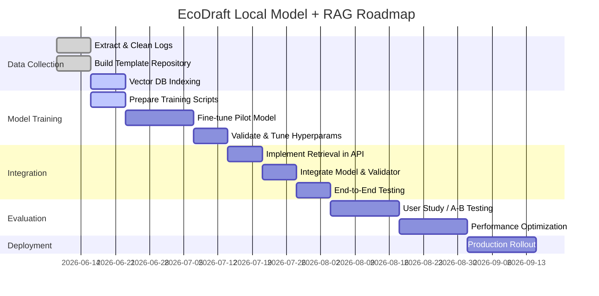

# Executive Summary

We propose augmenting Eco Draft’s AI layer with a **local fine-tuned CadIntent model and a retrieval-augmented generation (RAG) layer** for engineering templates.  In summary:

- **Leverage existing schemas:** Eco Draft already uses a *strict JSON CadIntent* schema (in `schemas/cad.py`) to describe user instructions, with classes for `CadIntent`, `CadState`, and `PartGeometry`.  The model’s task is to map an English prompt to this structured JSON exactly.  All downstream logic (part generation, checking, optimization) remains unchanged.  

- **Dataset from logs:** We will extract the prompt–CadIntent pairs and session history from the existing **SessionTracker logs**. These logs contain the user prompt and the resulting CadIntent JSON for each command.  Cleaning and deduplication will produce a fine-tuning dataset of at least *several thousand* examples.  We will augment it (e.g. paraphrasing, synonyms, noise injection) to improve robustness.  Example format:  
  ```json
  {
    "prompt": "Create a 200x100 base plate with four M8 holes",
    "cad_intent": {
      "action": "create",
      "part_type": "base_plate",
      "width": 200,
      "height": 100,
      "hole_count": 4,
      "hole_diameter": 8
    }
  }
  ```  

- **RAG layer for engineering context:**  In addition to the prompt, we will retrieve relevant engineering “templates” or rules to ground the model’s output.  We will index a library of **part templates and heuristics** (e.g. part descriptions, default dimensions, manufacturability rules) into a vector database (such as Qdrant, Weaviate or Pinecone).  At inference, the user prompt is embedded and used to retrieve similar template documents.  These documents (e.g. a JSON template for a “flange” with required fields) are appended to the input to the model.  This helps the model “know” domain constraints (e.g. minimum hole spacing) and fill missing fields more reliably.  

- **Local model and fine-tuning:**  We will evaluate small open LLMs (e.g. LLama3/Mistral 7B or 13B) for the CadIntent task. Using tools like **Unsloth** and Hugging Face’s PEFT library, we can fine-tune a few-billion-parameter model on a desktop GPU (e.g. 16–24 GB).  We will use LoRA or QLoRA for parameter-efficient tuning.  A pilot run might be as simple as:  

  ```bash
  # Example LoRA fine-tune snippet (HuggingFace+UnsloTh)
  from peft import LoraConfig, get_peft_model
  from transformers import LlamaForCausalLM, LlamaTokenizer, Trainer, TrainingArguments

  model = LlamaForCausalLM.from_pretrained("meta-llama/Llama-3-7b-chat", load_in_4bit=True)
  tokenizer = LlamaTokenizer.from_pretrained("meta-llama/Llama-3-7b-chat")
  data = ...  # Dataset of (prompt, CadIntent JSON)

  peft_config = LoraConfig(r=16, alpha=16, target_modules=["q_proj","v_proj"], dropout=0.1)
  model = get_peft_model(model, peft_config)

  training_args = TrainingArguments(
      per_device_train_batch_size=4, learning_rate=1e-4, num_train_epochs=3, 
      fp16=True, logging_steps=50
  )
  trainer = Trainer(model=model, args=training_args, train_dataset=data)
  trainer.train()
  model.save_pretrained("fine-tuned-cadintent")
  ```
  *See [Unsloth docs](https://unsloth.ai/docs/get-started/fine-tuning-llms-guide) for details on LoRA/QLoRA.*  

- **Validation and guardrails:**  The fine-tuned model’s output will be post-processed with a JSON schema validator (ensuring types and required keys match the CadIntent schema).  Then the existing rule-based **CheckEngine** and snapping logic are applied (e.g. enforce hole-to-edge spacing, valid diameters).  If the model produces invalid or out-of-range values, we fall back on defaults or re-query Gemini.  

- **Deployment:**  The model and RAG index will run locally or on a private GPU server.  We will serve it via a REST API or embed it in the app’s backend.  SessionTracker will be upgraded to persist between restarts (e.g. using a database or file).  We will A/B test the new model vs Gemini: for example, randomly route some queries to Gemini and some to the fine-tuned model, and compare error rates and response times.  

- **References & tools:**  We will draw on public CAD datasets and research.  For example, the *SldprtNet* dataset (242k SolidWorks parts) provides parametric CAD + text pairs, and *Text2CAD* (DeepCAD) published ~170k models and 660k instruction prompts.  Our fine-tuning data is smaller but similar in spirit.  Key tools include [Unsloth](https://unsloth.ai) for fine-tuning, Hugging Face `transformers`/`peft`, vector DBs (Qdrant, Weaviate, Pinecone), and graph/embedding libraries.  

- **Prototype plan:**  (See timeline diagram below) In the next week we will extract and clean the log data and index engineering templates into a vector DB.  In weeks 2–4 we will train a pilot fine-tuned model and build the RAG retrieval + prompt injection.  By week 6 we aim to have an end-to-end prototype (prompt → RAG → model → JSON → checks → CAD output).  

- **Risks:**  Key risks include insufficient training data (leading to poor generalization), the model hallucinating invalid parameters, and integration complexity.  We will mitigate by heavy schema validation and by combining rule-based checks.  If needed, we can keep Gemini as a fallback or use mixed prompting (e.g. “If unsure, ask for clarification”).  

Below we detail each aspect: requirements, data collection, RAG design, modeling, validation, deployment, resources, prototype milestones, and risks.

## 1. Requirements (from current code)

- **CadIntent schema:** The model must output a JSON matching Eco Draft’s CadIntent schema (see `schemas/cad.py`).  The schema is strict (no free text).  For example, a “create flange” intent may look like:  
  ```json
  {
    "action": "create",
    "part_type": "flange",
    "outer_diameter": 120,
    "hole_count": 8,
    "hole_diameter": 6
  }
  ```  
  Required fields vary by part type, but the model must supply all required keys with correct types (integers, strings, etc).  

- **Deterministic pipeline:** After the model outputs CadIntent, Eco Draft’s existing pipeline takes over: `UniversalPartGenerator` builds the `PartGeometry`, then `CheckEngine` validates manufacturability, then exporters produce SVG/DXF/PDF, and the result is logged via `SessionTracker`.  We must ensure the new model integrates seamlessly: its output JSON should feed directly into `CadState` and the generator.

- **Session context:** The system already feeds the last *10 states* into Gemini’s prompt. We should preserve this: the RAG/fine-tuned model can also receive prior state as context (or we can rely on re-parsing intents each step).  The session graph visualization already exists, which we will keep.  We must also replace the in-memory `SessionTracker` with a persistent store (e.g. writing to disk or a small database) so that history survives restarts.

- **Use of existing logic:** All rule checks, snapping (e.g. rounding dimensions to engineering multiples), and the NSGA-II optimizer will remain as-is. The model’s job is solely to predict correct intent parameters.  For complex reasoning (e.g. “reduce weight by 15%”), we still may rely on rule-based solvers or a specialized optimizer rather than expecting the LLM to invent non-trivial algorithms.

## 2. Data Extraction and Dataset Preparation

- **Log Inventory:** We will parse the existing `SessionTracker` logs, which record each user prompt and the resulting CadIntent JSON. For example, a log entry might be:  
  ```
  Timestamp: 2026-06-01T10:00Z
  Prompt: "Create a plate with four holes"
  CadIntent: {"action":"create","part_type":"plate","width":200,"height":100,"hole_count":4,"hole_diameter":5}
  ```
  We will extract all such pairs. If no logs exist yet (since it’s local), we may simulate or use known templates to generate initial examples.

- **Dataset Size:** Aim for at least **5,000–10,000** examples for initial fine-tuning.  If the app is still early-stage, we can bootstrap data by handcrafting prompts for each part type, or using the `UniversalPartGenerator` to produce synthetic variants (e.g. “Create a flange with diameter D” for D in {50,60,…}).  The Text2CAD paper had ~170k models and 660k prompts, which is far more than we have; even 5k–10k should significantly improve over zero-shot Gemini use.

- **Schema Formatting:** Each training item will be structured as a mapping from text to JSON. We will store them in a JSONL or CSV format suitable for SFT.  For example:
  ```json
  {"prompt": "Make a steel base plate 200x100 mm with 4 M10 holes", 
   "output": {"action": "create","part_type": "base_plate","width": 200,"height": 100,"hole_count": 4,"hole_diameter": 10}}
  ```
  (We may include field `"output"` or just directly the JSON as “completion” depending on fine-tuning setup).  

- **Cleaning:** We will filter out any malformed pairs (e.g. missing fields, badly parsed JSON).  Since Gemini already outputs strict JSON, errors should be rare.  We’ll deduplicate near-identical prompts.  We may normalize wording (e.g. “plate” vs “base plate”) so the model sees consistent terms.

- **Augmentation:** To improve robustness, we can augment the data by paraphrasing prompts or adding irrelevant words.  For instance, “Generate a base plate 200 by 100 millimeters with 4 M10 clearance holes” can be turned into “I need a 200x100 steel base plate with four holes (M10) at the corners.” Tools like back-translation or GPT paraphrasing can create variations.  We can also randomly add filler (e.g. “please”, “and so on”).  This helps the model focus on key phrases.  

- **Balanced coverage:** Ensure all part types (gusset, bracket, flange, etc) are represented.  If certain parts have special parameters (e.g. “rib_length” or “slot_length”), include those.  We’ll also include examples of *modify* commands, e.g. prompt “make it wider by 20%” mapping to an intent like `{"action":"modify","target":"plate","width":240}`, and negative examples like “no change” if needed.

- **Validation and Labeling:** After initial extraction, we will validate the dataset by re-running a JSON schema check on every “output” to ensure strict compliance.  Manual spot-checks (or small user studies) can catch mislabeled entries.  We may also split off a held-out test set (e.g. 10% of data) with diverse prompts to measure model accuracy.

- **Example schema snippet:** The CadIntent JSON schema might define something like:
  ```json
  // Example portion of schemas/cad.py
  CadIntent: {
    "action": {"type": "string", "enum": ["create","modify","delete"]},
    "part_type": {"type": "string", "enum": ["plate","flange","gusset",...]},
    // parameters vary by part_type:
    "width": {"type": "number"},
    "height": {"type": "number"},
    "hole_count": {"type": "integer"},
    // ...
  }
  ```
  We will ensure our training examples adhere exactly to these types.

## 3. RAG Layer for Engineering Templates

- **Purpose of RAG:** RAG (Retrieval-Augmented Generation) provides the LLM with relevant factual context. In our case, we will use RAG to feed the LLM *engineering knowledge* it needs (e.g. what fields a flange has, typical value ranges, or unit conventions).  This helps prevent hallucinations and ensures consistency with engineering rules.  

- **Template collection:** We will construct a set of “engineering template” documents. Examples include:
  - **Part templates:** For each part type (plate, flange, etc), a template JSON listing required/optional fields and default values, e.g.:
    ```yaml
    part: flange
    defaults: {material: "steel", thickness: 5}
    fields: {outer_diameter: "number (mm)", inner_diameter: "number (mm)", hole_count: "integer", hole_diameter: "number (mm)"}
    constraints: ["hole_count >= 1", "outer_diameter > 2*thickness", ...]
    description: "A circular flange with an outer diameter and center hole pattern."
    synonyms: ["pipe flange", "base flange"]
    ```
  - **Rule snippets:** Text describing constraints (e.g. “For a flange, hole_spacing >= 2× hole_diameter”) or design guidelines.
  - **Examples:** Descriptions of sample parts (from the database or CAD manuals).
  - **Q&A pairs:** Frequent questions (e.g. “What minimum edge distance for M8 hole?”).

  These can be simple markdown or JSON documents. The idea is to cover engineering knowledge Eco Draft relies on.  

- **Vector DB selection:** We will use a vector search engine to index the template documents. Options include **Qdrant** (open-source, Rust-based), **Milvus** (open-source, high performance), or hosted services like **Pinecone/Chroma**. Qdrant is a good open-source choice (optimised for fast nearest-neighbor search).  Key features needed: ability to store JSON metadata, filter by tags (e.g. part type), and perform approximate nearest neighbor (ANN) search.

- **Embeddings:** Each template is converted to an embedding vector. We can use OpenAI’s `text-embedding-ada-002` API (cited for explanation) or a local open-source embedder (e.g. SentenceTransformers).  For example:
  ```python
  from openai import OpenAI
  texts = [template_texts...]
  vectors = [OpenAI.embeddings.create(model="text-embedding-ada-002", input=t) for t in texts]
  ```
  These vectors are stored in the vector DB alongside the document text and metadata.  

- **Retrieval strategy:** At inference time, when a user prompt arrives, we embed the prompt (same embedding model) and query the vector DB for the top *K* relevant templates.  We expect to retrieve any part template whose description or fields match terms in the prompt.  For example, the prompt “add a flange 120 outer diameter” should retrieve the “flange” template document(s).  We may also apply simple keyword hints to filter by part type (if the model is already roughly classifying the part).  

- **Prompt templates:** The retrieved documents are concatenated (or summarized) into the prompt given to the CadIntent model.  For example:
  ```
  [Retrieved Template: Flange]
  Required fields: outer_diameter, inner_diameter, hole_count, hole_diameter. 
  Typical values: outer_diameter>inner_diameter, thickness≤max(outer_diameter/10,5).

  [User Prompt]
  Create a 120mm flange with 8 holes.

  [Structured Response Required]
  ```
  This context guides the model. We will design the prompt format carefully to ensure the model reads the template.  We can test different formats (bullet lists, plain text) for clarity.

- **Cache and latency:** For speed, we will cache embeddings of templates and possibly of common prompts.  Vector search is typically sub-100ms for K=5–10 with a decent vector DB.  We will benchmark the retrieval latency with realistic DB sizes (say 100–500 templates).  The tradeoff is between retrieval thoroughness and prompt length.  We should limit total added context (e.g. < 500 tokens) so as not to exceed model context windows.  

- **Tradeoffs:** Using RAG may add ~50–200ms to inference time due to the embedding lookup.  However, this overhead is worthwhile if it significantly reduces model errors.  If latency is critical, an alternative is offline incorporation: e.g. only retrieve templates once per conversation or per part type.

## 4. Model Selection and Fine-Tuning

- **Model choices:** We need an LLM that runs locally and can be fine-tuned on ~GB of data.  Candidates include:
  - **Meta Llama-3 family:** e.g. Llama-3 7B (instruct-tuned) or 13B. Widely used, excellent encoder-decoder architecture, OpenAI-like quality.
  - **Mistral 7B or 8x7B:** State-of-the-art open models (2023-24) with good performance per parameter.
  - **Qwen 7B-14B:** Another recent open model.
  - **Vicuna, Alpaca derivatives:** Possibly smaller, but less benchmark coverage.

  For quick experimentation, a 7B model is easier (fits in one GPU ~16GB).  For better accuracy, a 13B might be ideal if resources allow.  

- **Fine-tuning vs prompt tuning:** We prefer supervised fine-tuning (SFT) because the task is well-specified (structured output). We will **not** rely solely on prompting or chain-of-thought.  Instead we will fine-tune with LoRA/QLoRA.  As Unsloth notes, LoRA inserts low-rank adapters into the model and trains only those parameters, greatly reducing memory. QLoRA (4-bit) could allow tuning a 13B model on a 16GB GPU.

- **Hyperparameters:** A starting plan:
  - LoRA rank: 8–16 (larger rank = more flexibility, try 16 for safety).
  - α (alpha): 16.
  - Learning rate: ~1e-4 (standard for LoRA on LLMs).
  - Epochs: 3–5 on 5k–10k examples.
  - Batch size: 4–8 (depending on GPU).
  - Validation split: 10% of data for early stopping.
  - Loss: cross-entropy on token sequence (the CadIntent JSON text).
  - We will monitor *exact match accuracy* on the held-out validation set (how often the model’s JSON exactly matches expected).

- **Training compute:** A 7B model with LoRA and 10k examples can train in a few hours on an NVIDIA 3090/4090.  A 13B may take ~1 day on an A100. Unsloth claims their LoRA-optimized pipeline can run on as little as 3 GB VRAM (via QLoRA).  

- **Examples and prompts:** We will train the model in an encoder-decoder or chat format (depending on the base model). For instance, if using Llama-3-chat, we can frame each example as:
  - **User:** “Create a flange with diameter 120 and 8 holes”  
  - **Assistant:** `{"action":"create","part_type":"flange","outer_diameter":120,"hole_count":8,"hole_diameter":...}`
  Or simply fine-tune in a purely text format where input is the prompt and target is the JSON.  

- **Expected performance:** With a focused dataset, we expect the model to learn the mapping with high accuracy (e.g. >95% JSON-field accuracy).  In similar domains, small LLMs fine-tuned on structured tasks can surpass original GPT performance on that task.  We will measure correctness by key-wise matching and by running the geometry generator on outputs and checking consistency.

- **Evaluation:** We will test on held-out prompts, including paraphrases not seen during training, and edge cases (e.g. missing values, contradictory instructions).  We can also compare against Gemini’s outputs on the same test set to quantify improvements (e.g. fewer invalid JSON, fewer wrong units).

## 5. Validator/Guardrail Pipeline

- **JSON Schema validation:** Immediately after model generation, run a JSON schema validator against the CadIntent schema.  If the JSON is invalid (missing keys, wrong types), trigger a fallback. For example:
  - Missing numeric field: set to a default or 0, and log a warning.
  - Non-numeric where numeric expected: coerce or reject.
  - Extra fields: strip them.

- **Rule engine (CheckEngine):** Use the existing `CheckEngine` to verify manufacturability rules. If a parameter violates a rule (e.g. “hole too close to edge”), we can either:
  - Automatically adjust (snap) the value to the nearest valid (e.g. increase edge distance to meet minimum).
  - Reject and ask the user to rephrase (e.g. return an error message).
  In most cases, snapping is preferable to keep automation smooth.  

- **Snapping to standards:** The code already has “hard-snapping” rules (e.g. standard hole diameters). After validation, we will enforce any engineering standards (e.g. metal thickness multiples, M-size diameters).  For instance, if the model outputs `hole_diameter: 7`, we might snap to 6 or 8 mm depending on context.  These are deterministic fixes, not learned.

- **Fallback strategies:** If the model’s confidence (or output) is poor, we have options:
  - Use the original Gemini model as a fallback for that query.
  - Fallback to an intermediate step: e.g. first ask a clarification question to the user.
  - For critical failures (e.g. the model outputs nonsense), we keep the “Make me a better prompt” approach: prompt the user to rephrase.  
  Our aim is to catch most errors via validation so the end-user rarely sees them.

## 6. Deployment Architecture

```mermaid
flowchart LR
    A[User Chat Prompt] -->|HTTP| B(RAG Retriever)
    B --> C((Vector DB Index))
    C --> D[Retrieve Templates]
    D --> E{LLM Input}
    E --> F[CadIntent Model (fine-tuned LLM)]
    F --> G[JSON Schema Validator]
    G --> H[Rule Engine & Snapping]
    H --> I[CadIntent JSON]
    I --> J[PartGeometry Generator]
    J --> K[CheckEngine (manufacturability)]
    K --> L[SVG/DXF Exporter]
    L --> M[Response to User]
```

- **Local inference stack:** The model can be hosted as a local microservice (e.g. using `fastapi` or similar) with GPU acceleration.  Alternatively, a library like vLLM could be used for high-throughput inference.  RAG retrieval and vector DB can run as a sidecar service; Qdrant or Milvus run locally or on a private server.  

- **API design:** We will expose an API endpoint (e.g. `/predict_intent`) that takes the user’s latest prompt and session context, and returns the CadIntent JSON (and any checks).  The frontend (React) then shows updated drawing.  Latency target: ideally <1 s total. Model inference (~300 tokens) should be sub-500ms on a good GPU. Retrieval ~100ms. The existing polygon export is fast (tens of ms).  

- **Batching:** If multiple prompts arrive (not likely in chat UI), we can batch inference for efficiency.  Otherwise, run single inference per query.  

- **Session persistence:** Replace the in-memory `SessionTracker` with a persistent storage (e.g. SQLite or JSON file per session).  Each session’s sequence of prompts/intents should be saved to disk.  This also allows offline analysis.  

- **A/B Testing:** We will run the fine-tuned model in parallel with Gemini on a subset of cases.  We can randomly route 50% of sessions to “new” and 50% to “old” mode, logging which produces better results.  Over time, we expect the fine-tuned model + RAG to reduce error rate.  

## 7. Datasets, Tools, and References

- **CAD datasets (for inspiration and possible augmentation):**  
  - *SldprtNet* (ICRA’26): 242,000 SolidWorks parts with parametric text scripts. It provides multi-view images and text descriptions for each part, demonstrating aligned CAD-<text> data for training.  
  - *ABC Dataset* (3D CAD models): 1M+ STEP models for geometric deep learning. (No text, but shows scale of CAD data.)  
  - *DeepCAD* (NeurIPS’24, Text2CAD): ~170K CAD models + 660K text instructions. (Used to train a transformer on parametric CAD from text.)  
  - *Fusion360 Gallery*, *Onshape Public Data*, *GrabCAD*: Community part libraries (mainly meshes/B-Rep). These can supply examples of part parameters or descriptions.  

- **Fine-tuning and modeling tools:**  
  - [Unsloth](https://unsloth.ai) – framework for efficient fine-tuning (LoRA/QLoRA) on modest hardware.  
  - HuggingFace Transformers and PEFT libraries – for model loading, LoRA injection, and training.  Example HuggingFace LoRA doc: “LoRA inserts a small number of new weights into the model and only these are trained”.  
  - *Embedding models:* OpenAI’s `text-embedding-ada-002` is a proven embedding for RAG (OpenAI docs: “embeddings are a numerical representation of text that can be used to measure relatedness”).  Local alternatives include HuggingFace SentenceTransformers (e.g. `all-MiniLM`).  

- **Vector DB:**  
  - **Qdrant** – open-source vector engine (Rust-based) designed for fast similarity search.  
  - **Milvus** – another open source vector DB with scalable indexing.  
  - **Weaviate** or **Pinecone** – cloud options with built-in semantic search (Pinecone is managed, Weaviate can run locally or cloud).  

- **RAG frameworks:** For inspiration: the *MechRAG* system (Nature Comm. Eng., 2025) uses RAG to integrate CAD/CAE data into LLM workflows. We will not copy their multi-modal aspects, but the retrieval concept is similar.  Standard RAG tutorials (e.g. Weaviate docs) explain the pattern of retrieve-then-LLM.  

- **Other references:**  
  - The *HuggingFace PEFT* (Parameter-Efficient Fine-Tuning) docs on LoRA.  
  - The *Unsloth FAQ* (“fine-tuning can replicate all of RAG’s capabilities”) provides guidance on approach.  
  - CAD-specific research: e.g. *Text2CAD* and *SldprtNet* papers for dataset structure and parametric representation. These inspire our schema design and dataset usage.

## 8. Prototype Plan and Milestones

We propose the following timeline:



- **Week 1 (June 9–16):** Extract all prompt–intent pairs from logs. Define and gather engineering templates (part specifications, rules). Set up the vector DB and index the templates.  
- **Week 2 (June 16–23):** Write training scripts (using Unsloth/PEFT). Preprocess data (tokenize JSON properly). Run initial LoRA fine-tuning on a subset.  
- **Week 3 (June 23–30):** Evaluate pilot model on validation prompts. Adjust hyperparameters (learning rate, LoRA rank). Augment data as needed.  
- **Week 4 (July 7–14):** Implement the retrieval API: on a prompt, embed and query vector DB. Format the prompt+context into the model input.  
- **Week 5 (July 14–21):** Integrate the fine-tuned model into the app pipeline. Add JSON validation logic and connect to CheckEngine.  
- **Week 6 (July 21–28):** End-to-end testing with various prompts. Fix integration bugs. Measure latency of retrieve+infer.  
- **Weeks 7–8 (Aug 4–18):** Conduct A/B tests with sample users or simulated prompts. Monitor error rates vs Gemini baseline. Optimize indexing (e.g. try different k, filters).  
- **Deployment (Early Sept):** Deploy the model for all users. Continue logging performance and gather more data for future fine-tuning.

## 9. Risks and Mitigation

- **Insufficient data:** If logs are sparse, the model may underfit. *Mitigation:* Augment data via paraphrasing, use synthetic generation (scripted prompts), or weak supervision (ask GPT to generate extra examples).  
- **Hallucinations/Invalid JSON:** The LLM might still output wrong keys or values. *Mitigation:* Strict schema validation rejects bad outputs. We can fall back on rule-based defaults or ask the user to rephrase.  
- **Out-of-domain prompts:** Unseen instructions (e.g. very creative tasks) may confuse the model. *Mitigation:* Combine with open-ended Gemini or prompt the user for clarification.  
- **RAG misretrieval:** The retrieved template might not match the prompt context, adding noise. *Mitigation:* Use a moderate $K$ (3–5 templates) and simple keyword filtering to ensure relevance.  Evaluate retrieval quality with sample queries.  
- **Performance/cost:** Large models increase latency and GPU costs. *Mitigation:* Start with small models; prune or quantize if needed. Monitor inference time. If speed is an issue, consider lighter models or sparse attention.  
- **Integration complexity:** Adding a whole new ML pipeline can introduce bugs. *Mitigation:* Develop incrementally. Maintain a fallback path using the existing Gemini prompt for comparison.  

By following this plan and leveraging the existing codebase (CadIntent schema, part generators, checkers), we can replace Gemini with a local fine-tuned model + RAG that is more deterministic, efficient, and auditable.  

**Sources:** Unsloth fine-tuning docs; HuggingFace LoRA docs; MechRAG (RAG for CAD/CAE); RAG overview; SldprtNet dataset paper; Text2CAD/DeepCAD paper; OpenAI embeddings doc.  

